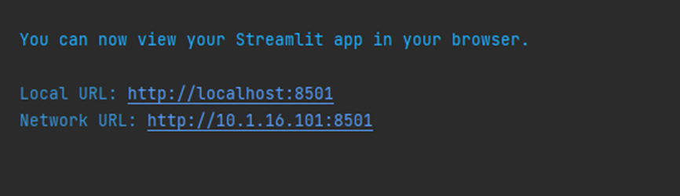
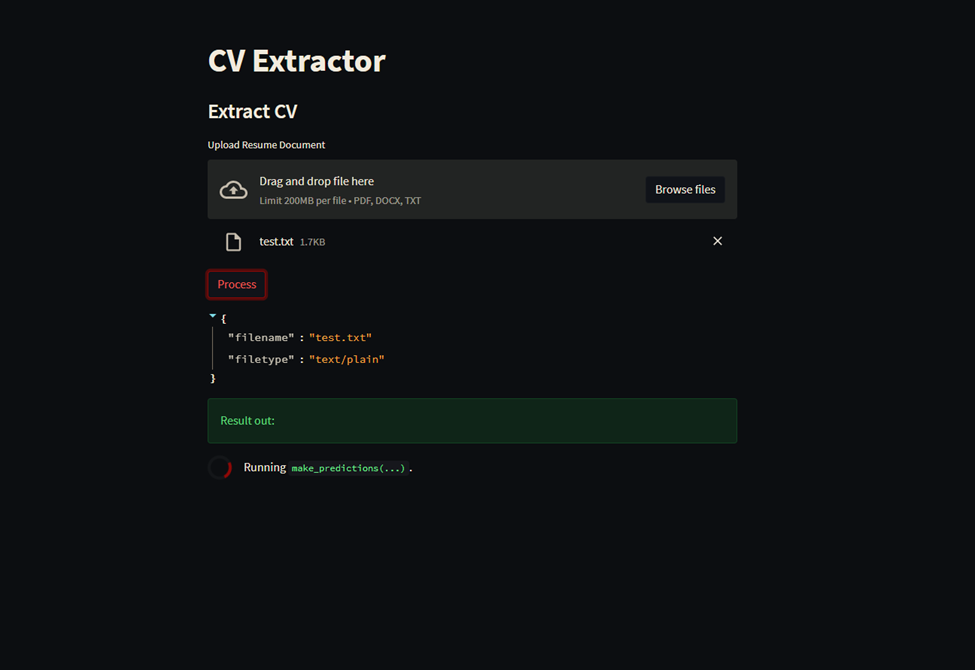

# **CV Extractor**

A project from subject ICT30001 – Swinburne University of Technology Vietnam. This project using Pytorch model (‘[xlm-roberta-based’](https://huggingface.co/xlm-roberta-base) pretrained) to identify the NLP entities and extract resume into selected fields and displayed on GUI (hosted with streamlit). 
### **Feature:**
Uploading file with three formats (docx, pdf and text plain). The application will then automatically identify and export selected fields, which included:

- Basic information (Name, email, phone number)
- Organization and job positions or degree related
- Industrial skills (mainly IT skill set).
### **Installation**
It is required that you installed the Python 3.9 version or above with pip installed

It is highly recommended that you install all the dependencies, packages and libraries in the [Python virtual environment](https://docs.python.org/3/library/venv.html).

To install the requirements packages, run the following command:

```pip
pip install -r requirements.txt
```

### **Usage**
As the application is hosted with streamlit, run the following command in order to use the application:

```pip
streamlit run main.py
```

After successfully running the python file, a new website will be automatically opened on your default browser. If not, please specified to the terminal view with URL provided:



When you access the webpage successfully, you will see the uploader section with information around. Please upload document file and click on Process button to run the predictions, the result then will be showed.

